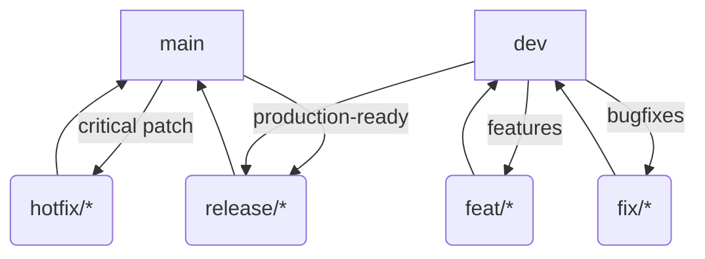

## 🚀 Contributing Guide

### 👇 Branch Naming Convention
Follow this format for your branches:
```
[type]/[scope]-[short-description]
```
Examples:
- `feat/hmr-sync/add-rebuild-trigger`
- `fix/hmr-sync/path-error`
- `docs/readme/update-usage`
- `hotfix/hmr-sync/critical-fix`

Supported types:
- `feat` – New feature
- `fix` – Bug fix
- `docs` – Documentation only changes
- `chore` – Maintenance or meta changes
- `refactor` – Code restructuring without changing behavior
- `test` – Adding or fixing tests
- `release` – Release branch
- `ci` – Continuous integration updates
- `build` – Build system updates
- `perf` – Performance improvements
- `revert` – Reverting previous commits
- `hotfix` – Critical quick-fix changes

### 🧭 Branching Strategy (Visual)


### 🔄 Workflow Overview
1. Developers create feature/bugfix branches from `dev`.
2. Feature/bugfix branches are merged into `dev` via PR.
3. Once `dev` is stable, a `release/*` branch is cut and PR'd to `main`.
4. Critical patches go directly to `hotfix/*` from `main`.
5. All merges to `main` trigger semantic release to GitHub + npm.

### 📥 Pull Requests
- Target the `dev` branch for features and fixes.
- Target the `main` branch only for `release/*` or `hotfix/*` merges.
- Ensure branch name follows naming rules.
- PRs require passing CI and review before merge.

### 🛡️ Protected Branches
- 🔒 `main` and `dev` are protected — no direct or force pushes.
- 🚫 PRs must pass all required checks.
